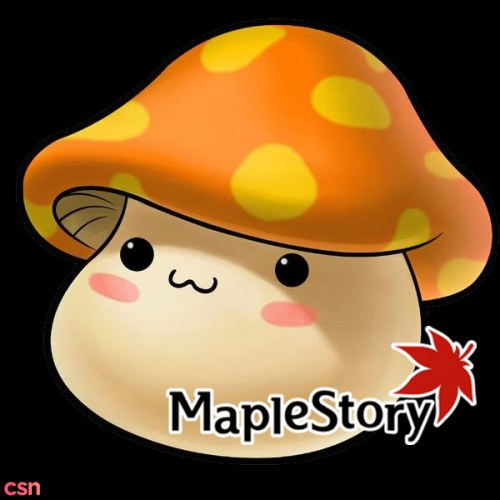

## Early Beginnings
As a toddler, I pictured the walls of our apartment like a giant white canvas. Holding several crayons in my hand, I managed to cover every space, every corner with a doodle of some sort. From that point onward, my parents had discovered my newfound talent--to be able to tarnish a white wall in a matter of seconds. In other words, I was a wall-wrecker, but at least I was able to communicate and express my thoughts through illustrations, more so than words. Thus, I was, for a long time, convinced that art was the right path for me. However, as the years progressed, I began to take an interest in something else.

## Let me try that!
I recall the first time my brother got his first laptop, and on it, he had the game, Maplestory installed. I was intrigued by every nook and cranny of the gameplay the moment he had introduced me to the game. It was astonishing how we can design the characters, interact with other players worldwide, and interlace in combats together. With the click of a mouse, I was entering a whole new realm. From there grew my interest in computer games. Throughout my high school career, I didn't have any experience with programming, as there weren't any programming classes offered, but a STEM class. Initially, I thought that STEM only involved robotics, but taking this class in my senior year proved me wrong. I also got to experiment with an Arduino and see how the code and mechanics come together. I realized that there were so many more languages that existed out there. This inspired me to take a Python class in the summer, bringing me further into the realm of Computer Science. 

## Proceeding Forward
Now that I have decided to major in Computer Science, I aspire to gain ample knowledge in software engineering to help me understand the inner-workings of games. I want to develop the skillset that I will need in order to understand the basic framework of a game, and the strategies involved in manipulating things a certain way. I have hopes that someday, I too will develop or be a part of the production of a game that will entertain as much as Maplestory has captivated me as a teenager. 
