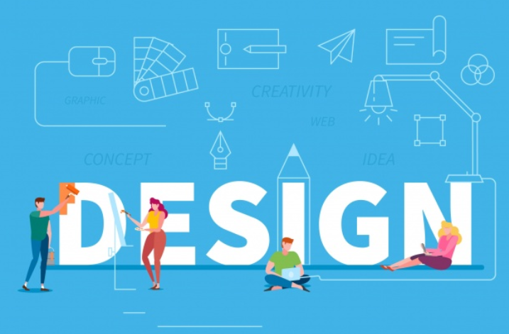

## Learning Semantic...Is it Worth it?

Learning HTML is fairly simple and doesn’t involve too many elements to play around with. However, getting into CSS and further applying Semantic UI got me lost and confused with the opening and closing tags because there were so many divs being created. It was definitely not an easy process. For me, learning Semantic UI was just as difficult as learning a new programming language because of the thinking required to manipulate a website to look a certain way. When designing a website, coming up with an engaging layout is one part of the challenge, but developing that website might be the bigger obstacle because it requires problem-solving to properly format the website. Using raw HTML and CSS is possible, but frameworks like Semantic UI exist to give websites those cool buttons and dropdown menus that could appear by a simple hover. These frameworks are the foundation for modern, beautiful, and interactive websites. A major issue is that beginners would have to take time to learn and be accustomed to the framework general features like implementing a navigation menu or having a search bar. But with practice and repeated use of it, one could finally reap the benefits and enjoy the huge variety of features that Semantic UI has to offer. Once we get the hang of it, much more time is saved when we want to format our websites a certain way.  

## Plain Websites are a thing of the past!

Web design is a fairly recent concept. In the old days, frameworks like this probably did not exist and every website lacked taste. Presumably, the appeal of the website didn’t matter at the time because it was already an achievement to get on the World Wide Web. It was only in [1993](https://historycooperative.org/web-design-through-the-years/) that websites started allowing images to be added. Unfortunately, Internet connection speeds at the time weren’t up to par, resulting in a long wait for the images to load. Luckily, technological advancements have allowed for better speeds which prompted people to start honing in on front end web development. As more websites were bring created, the competition for a better layout immediately heightened, so did the demand for web designers. It seems that the look and feel of a website did not matter until everyone started using the Internet. Today, almost every website that we come across uses a framework of some sort to attract the attention of consumers. 

From my personal experience, I can say that a dull website with plain HTML and CSS is very off-putting and draws the attention away from viewers. When students are tasked to take notes or read information off of websites like these, it would easily bore them out. I myself have been unmotivated to take notes merely because of how uncomfortable it is to read pages that are totally cluttered with words that sometimes span the width of the website. With the availability of tools out there, and from the short experience we had with Semantic UI, I believe that it shouldn’t take too much effort to create a website that will make learning fun for students. 

## Pretty Websites For the Win!

It was overall, a fun experience playing with Semantic UI and mimicking other websites that I never knew I could make. I am pleased with the knowledge I’ve gained from fiddling with one of the frameworks that enable such interactive features on a website. I have since learned that using frameworks like Semantic UI gives personality to the website and I believe that this experience is also good practice for web development careers in the future, or just useful background knowledge to have in general. In terms of business and marketing, a nice website is what attracts consumers, and if they are satisfied, profits are the likely outcome. Ultimately, a website could do a whole lot as to whether or not a customer will buy a product. 

