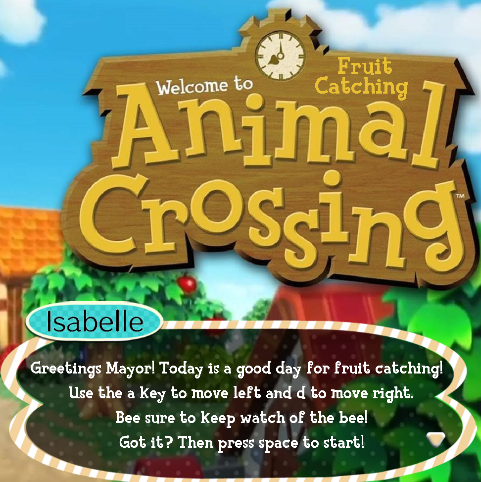
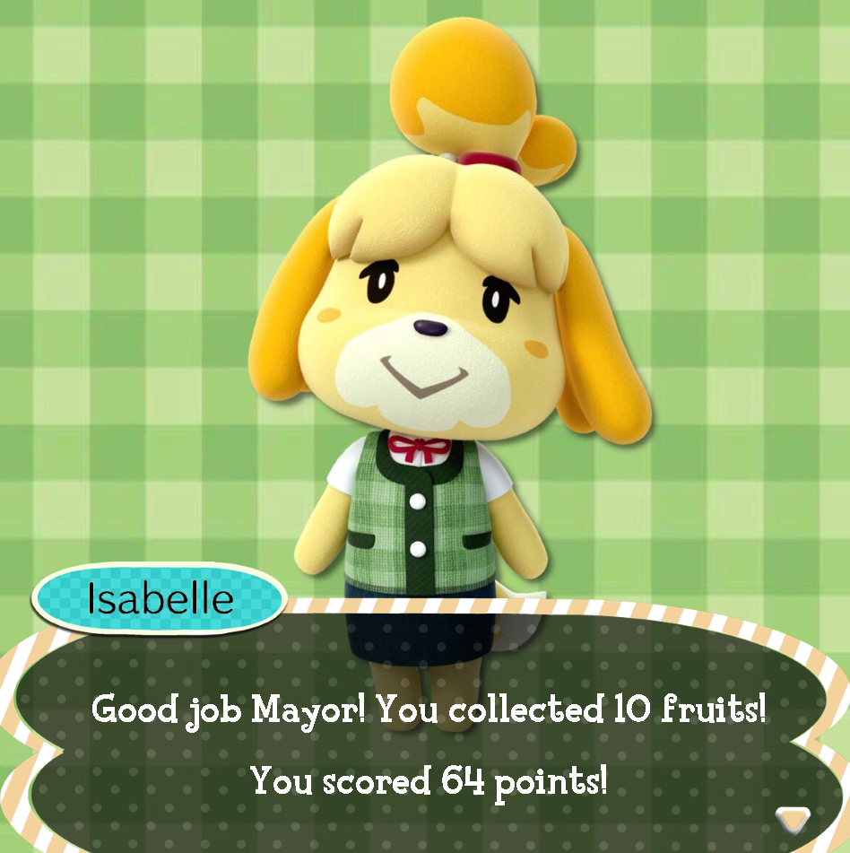

  

This game, titled "Animal Catching," is an Animal Crossing-themed game in which the user uses 'w' or 'a' keys on their keyboard to move the basket left or right, respectively, on the screen. The objective of the game is to catch as many of the falling fruits as possible before the user's lives run out. Six lives are given, and the user is faced with an obstacle, that is, a wasp that will spawn some point in the game. After its appearance, the wasp will continue to spawn until all the user's lives are out, essentially acting as a timer.

 
I collaborated with my partner on this game for the final project of ICS 111. Using the UH multilibrary, EZGraphics, we were able to incorporate sounds and images from the internet into our game. We worked to implement several components: a welcome screen with 'space' button to activate the game, a score that increases every time a fruit lands into the basket, a points system for specific fruits collected, a count of hearts for the number of lives left, and a game-over screen. I helped with the organization, the design, and ways to make the game user-friendly by having clear instructions.

The process of making this game has taught me how to design a game with Object-Oriented programming and ways to develop code for a task at hand, such as obstacle detection. I've also learned to simplify things by creating methods that will be used in different areas of the game. 

 
 
Source: <a href="https://github.com/wjinyan/animalcatching"><i class="large github icon "></i>wjinyan/animalcatching</a>
