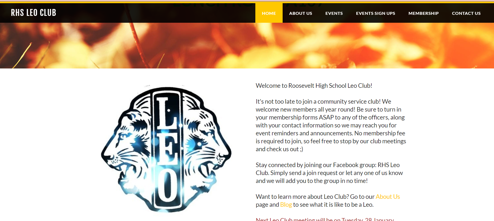

During my time in high school, I was an active member of the Roosevelt Leo Club, a community service club that stood for "leadership," "experience," and "opportunity." Engaging in this club gave way to experiences outside of school and opportunities to collaborate with other organizations that are helping to improve the community.

I contributed to this club by being historian and vice president. As a historian, I was able to create a scrapbook for the state-wide leo club contest which documented all the events that leo club members have participated in for an entire school year. The scrapbook had resulted in first place. As vice-president, I helped with the club's fundraisers and regulated the signups for the events with different volumes of volunteers. I also took part in calculating the total amount of volunteer service hours for all the members, and editing the layout of the club website. 

From my experience in Leo Club, I learned ways to manage the large volumes of event signups, prioritizing members that had signed up for events first, based on the timestamps of the online submissions. Being in a leadership role, I have also learned ways to cooperate with the creativity of other club officers to formulate plans that would keep the club not only stable, but fun for the members as well.  

Source: <a href="https://rhsleoclub.weebly.com/">rhsleoclub.weebly.com</a>
